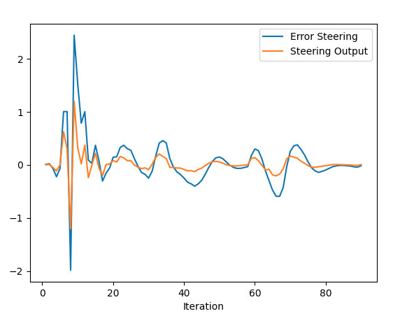
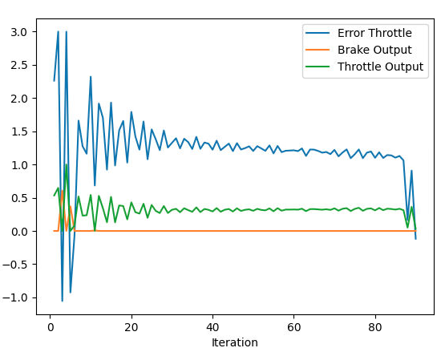

# Answer the following questions:

## Add the plots to your report and explain them (describe what you see)
1. Steering PID 

Here, we see that the steering output follows the steering error closely (If the PID coefficients are negative signed, then the error should be of the opposite sign of the control output, but in this case, I used positive coefficients), and there appears to be a sharp oscillation at the start but eventually the amplitude of the oscillations smoothen out, and starts to converge to 0. 

2. Throttle PID

Here, we see that the throttle output mirror that of the error throttle, and similar to the steering output, the amplitude of the  oscillations about the error are reduced.  However, because we clamped the value of the throttle to -1 and 1, it should not exceed 1 (as seen at the start).

## What is the effect of the PID according to the plots, how each part of the PID affects the control command?
    - Proportional (kP) increases the gain, which causes the errors to be corrected at a faster rate, however, setting it to a higher than optimal value leads to overshoot and oscillation about the desired value
    - Derivative (kD) helps to reduce the effects of overshoot from the proportional term by damping the gain based on the rate of change of the output
    - Integral (kI) sums up the errors from the past, and therefore helps to reduce the amount of oscillation before it settles at the desired value

## How would you design a way to automatically tune the PID parameters?
    - We could use the twiddle algorithm, which performs iterates through different sets of PID values and determines which set leads to the optimal PID parameterse. It is a form of parameter optimization.

## PID controller is a model free controller, i.e. it does not use a model of the car. Could you explain the pros and cons of this type of controller?
    - Pros
        - There is no need to base the controller off a complex model of the car, the PID controller can be applied to different types of cars, however the set of PID parameters will have to change.
        - Easier to understand, tune and deploy the model.
        - Does not require as much computational resources compared to other more advanced controllers
    - Cons
        - PID parameters may tuned optimally for a particular scenario might fail to work well in another scenario.
        - PID Controllers to not take into account the complexity of cars, leading to potentiall
        - PID Controllers are single input, single output controllers. If we have 2 or more inputs (throttle and steering), then it becomes difficult to tune and optimize the controller for multiple desirable outputs.
        - PID controllers tend to oscillate about the desired value even when optimally tuned.

## (Optional) What would you do to improve the PID controller?
