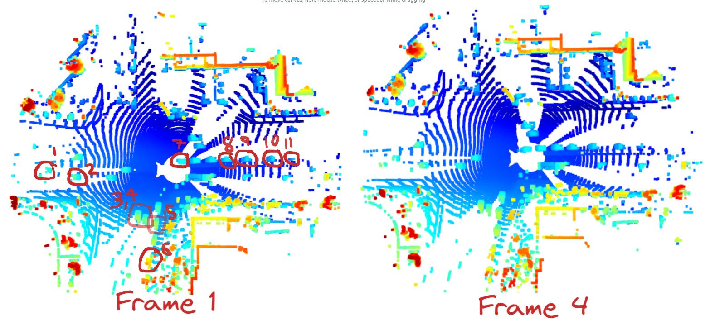
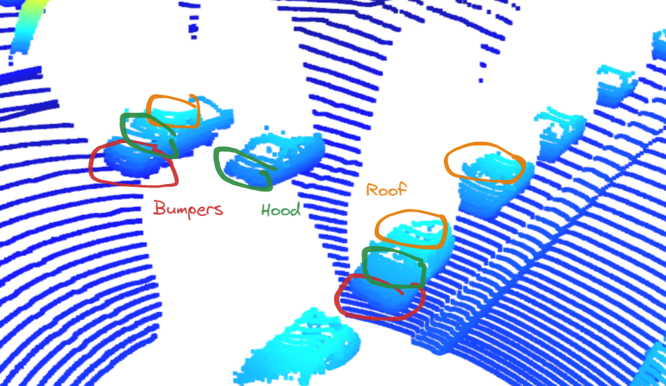
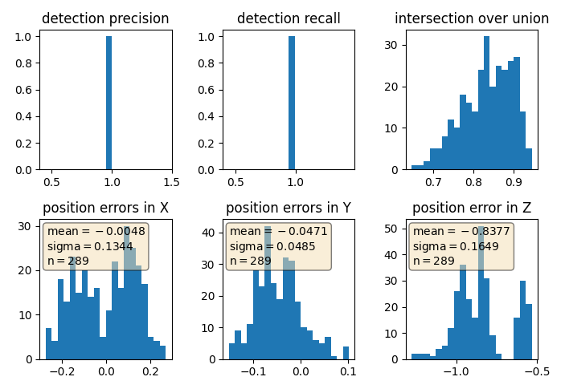

# 10 Examples of vehicles with varying degrees of visibility in point cloud

Here, we compare 2 point clouds, one from frame 1 and another from frame 4.

# Vehicular features that appear stable in most inspected examples

Here, we can see that 3 distinct features: The hood, bumpers and roof are stable across the frames

# Darknet Model Evaluation

